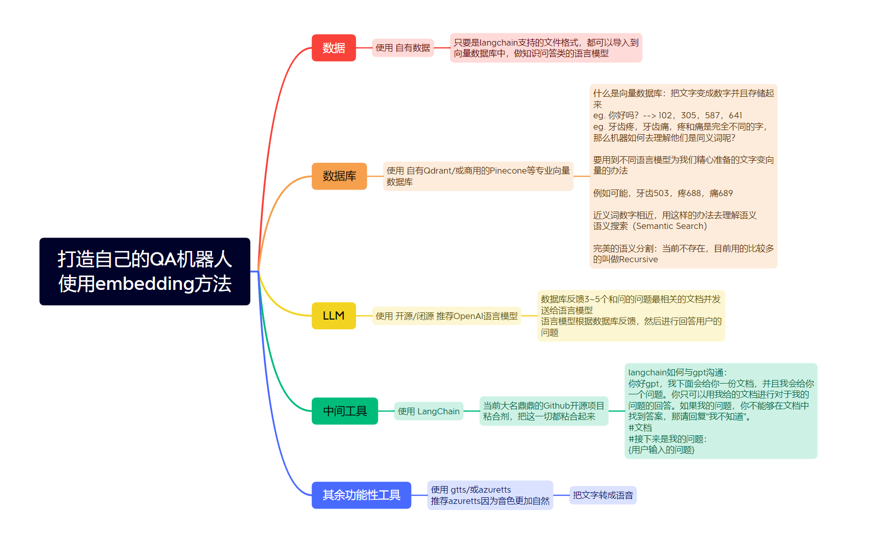

# 我的项目

## 代码说明

这个项目的代码是我在学习LLM过程中的代码，我实现了一个小的对话机器人，基于ChatGPT和后台embedding数据库实现目标。

**代码分为两个小项目，一个是运用了RAG技术的单轮对话模型：**

- `keys.py`：存储了三个key（openai、pinecorn api、pinecorn env）
- `A_create_embed_database.py`：根据给出的doc和docx数据，生成embeding并存储到pinecorn数据集
- `A_myBot.py`：实现了单论对话模型，运用了RAG技术，可以从pinecorn数据集中获取匹配的信息。

**另一个是运用了RAG技术的多轮对话ChatBot机器人**

- `B_chatbot_no_UI.py`：运用了RAG技术的多轮对话机器人，但是不带UI

- `B_chatbot_with_UI.py`：运用了RAG技术的多轮对话机器人，带UI，后台实现跟`B_chatbot_no_UI.py`是一样的

# 前项目的ReadMe

## Ai Dentist牙科医生

这个教程帮助新手小白搭建自己的问答机器人，当然数据这方面需要大家自己准备哦！视频里我为大家解释了问答机器人的工作原理以及推荐使用到的第三方软件，还和大家分享了我的一些对于特定词汇的类比理解方法便于大家更好地掌握一些Ai领域的英文词汇。
这是一个教学仓库，重要和相关的代码都已经做好了注释，方便伙伴们阅读。

## 创建问答机器人我们需要些什么？

## 使用到的工具或GitHub项目

[LangChain](https://github.com/hwchase17/langchain) 帮助粘合下面的需要用到的各种工具

[Streamlit](https://github.com/streamlit/streamlit) 用来快速创建网站的开源工具

[PineCone](https://www.pinecone.io/) 作为专业的向量数据库

[OpenAi API](https://openai.com/blog/openai-api) 大语言模型帮助我们分析文档以及回答问题

[Google Text To Speech](https://cloud.google.com/text-to-speech/) 帮我们将文字转化成语音

## 录频地址

[Bilibili](https://www.bilibili.com/video/BV1mL411q7cK/) 记得一键三连哦
